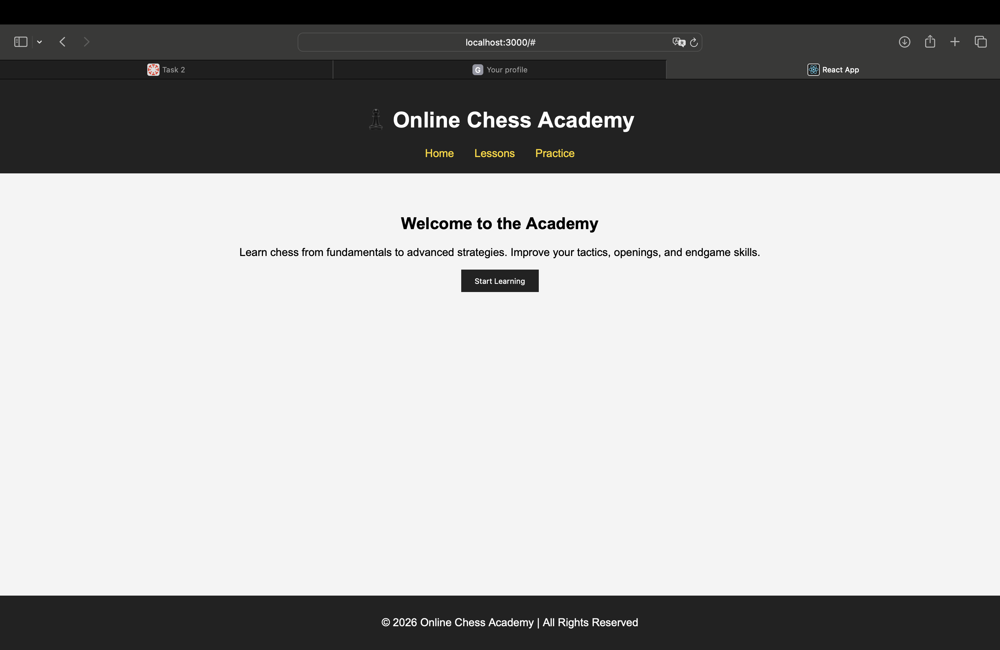

Project Idea & Purpose:
Online Chess Academy is a web application designed to help beginners and intermediate players improve their chess skills through structured lessons, practice 
exercises, and game analysis tools. The goal of the platform is to make chess education accessible and interactive in a simple and modern web interface.

Target Audience:
The target audience includes beginner and intermediate chess players, students who want to improve their tactical and strategic understanding, and anyone interested in structured chess learning online.

Problem the Application Solves:
Many beginners struggle to find structured and organized chess learning materials. Online Chess Academy provides categorized lessons, practice problems, and interactive components in one place, making learning efficient and engaging.

Minimum Viable Product (MVP) Features:
1. Home page with academy introduction
2. Lessons page (basic chess principles)
3. Simple navigation system
4. Structured component-based layout
5. Clean and responsive UI

What is a Single Page Application (SPA)?
A Single Page Application (SPA) is a web application that loads a single HTML page and dynamically updates content without reloading the entire page. Instead of requesting new pages from the server, the application updates specific parts of the interface using JavaScript. This provides a smoother and faster user experience.

How does SPA differ from MPA?
A Multi-Page Application (MPA) reloads the entire page every time the user navigates to a different section. In contrast, an SPA loads content dynamically without full page reloads. SPAs are generally faster after initial load and provide a more app-like experience.

What is the Virtual DOM?
The Virtual DOM is a lightweight copy of the real DOM used by React. When changes occur, React updates the Virtual DOM first, compares it with the previous version, and then updates only the necessary parts of the real DOM. This improves performance and efficiency.

Why does React use component-based architecture?
React uses a component-based architecture to make applications modular, reusable, and easier to maintain. Each component represents a part of the UI and can be reused across different pages. This improves scalability and code organization.

## Application Screenshot

