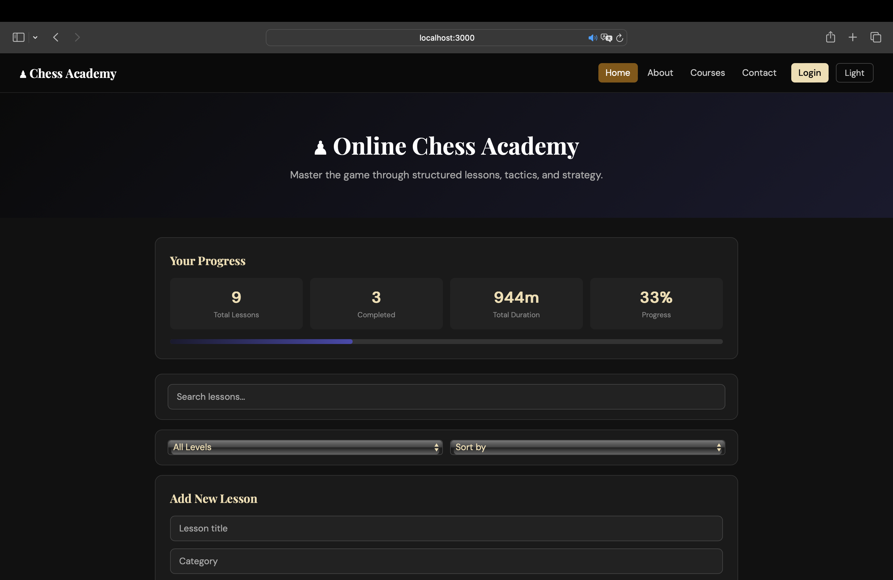
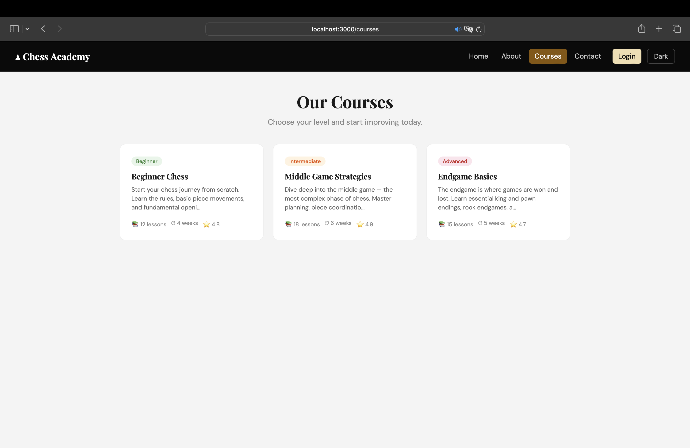
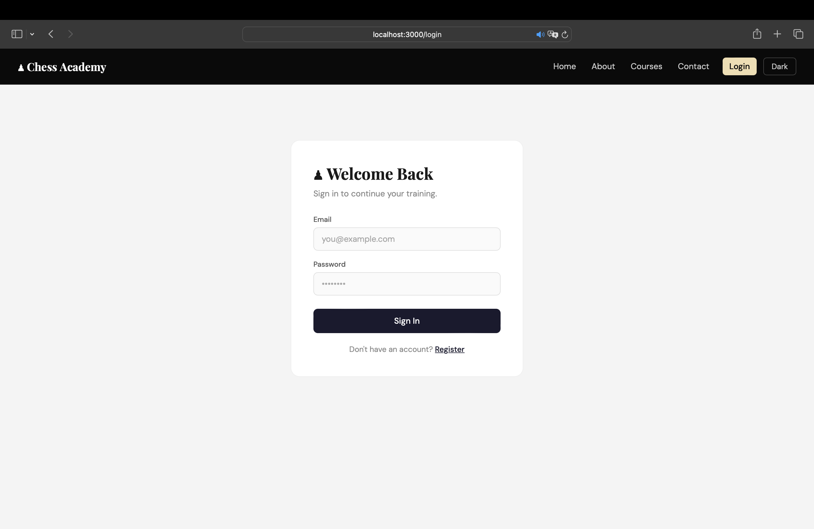

# ♟ Chess Academy

A full-featured React SPA for managing chess lessons and courses. Built as a semester-long project covering core and advanced React concepts.

## 🚀 Live Demo
> Add your Vercel/Netlify URL here after deployment

## 🛠 Tech Stack
- React 18
- React Router v6
- Context API (ThemeContext, UserContext)
- MockAPI (REST API)
- CSS3 (custom, responsive)
- localStorage for persistence

## ✨ Features
- 🔐 Authentication — register, login, logout with credential validation
- 🌙 Dark / Light theme toggle with persistence
- ♟ Lessons CRUD — add, edit, delete, complete via real API
- 🔍 Real-time search with debounce, filter by level, sort by title/duration
- 📚 Courses page with nested routes and detail view
- 🛡 Protected routes — unauthenticated users redirected to login
- 📱 Fully responsive — mobile and desktop
- 💾 localStorage persistence — theme, user session
- ⚡ useMemo for optimized filtering, useCallback for handlers
- 🔄 Loading, error, and empty states for all API operations

## 📁 Project Structure
src/
├── components/      # Reusable UI components
├── context/         # ThemeContext, UserContext
├── data/            # Static course data
├── hooks/           # useFetch, useLocalStorage, useDebounce
├── pages/           # All page components
├── services/        # API service layer (lessonService)
├── utils/           # Helper functions
├── App.js
├── index.js
└── styles.css

## ⚙️ Setup Instructions

1. Clone the repository
```bash
git clone https://github.com/YOUR_USERNAME/chess-academy.git
cd chess-academy
```

2. Install dependencies
```bash
npm install
```

3. Start the development server
```bash
npm start
```

4. Open [http://localhost:3000](http://localhost:3000)

## 📸 Screenshots

### Home Page


### Dark Mode


### Courses


### Login


## 🔗 API
Lessons data is powered by [MockAPI](https://mockapi.io).  
Base URL: `https://69edf76d9163f839f89259ed.mockapi.io/lessons`